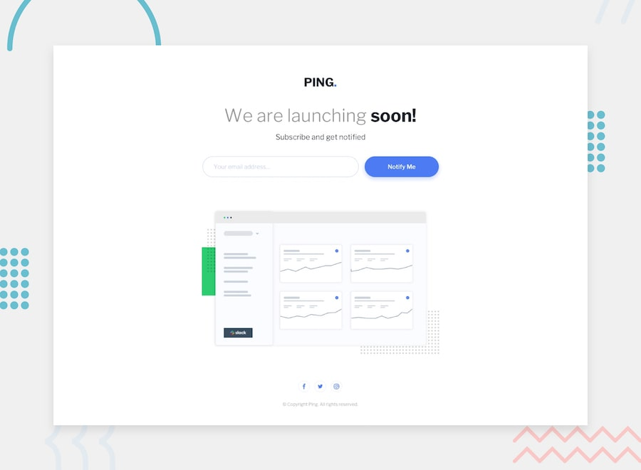

# Frontend Mentor - Ping coming soon page

## Welcome! 👋

Thanks for checking out this front-end coding challenge.

[Frontend Mentor](https://www.frontendmentor.io) challenges help you improve your coding skills by building realistic projects.

**To do this challenge, you need a basic understanding of HTML, CSS and JavaScript.**

## The challenge

Your challenge is to build out this Coming Soon page and get it looking as close to the design as possible.

You can use any tools you like to help you complete the challenge. So if you've got something you'd like to practice, feel free to give it a go.

# Front-end Style Guide

## Layout

The designs were created to the following widths:

- Mobile: 375px
- Desktop: 1440px

> 💡 These are just the design sizes. Ensure content is responsive and meets WCAG requirements by testing the full range of screen sizes from 320px to large screens.

## Colors

### Primary

- Blue: #4F7DF3

### Secondary

- Pale Blue: #C2D3FF
- Light Red: #FF5263

### Neutral

- Gray: #969696
- Very Dark Blue: #151F29

## Typography

### Body Copy

- Font size: 20px

### Fonts

- Family: [Libre Franklin](https://fonts.google.com/specimen/Libre+Franklin)
- Weights: 300, 600, 700

## Icons

For the social icons, you can use a font icon library. Some suggestions can be found below:

- [Font Awesome](https://fontawesome.com)
- [IcoMoon](https://icomoon.io)

